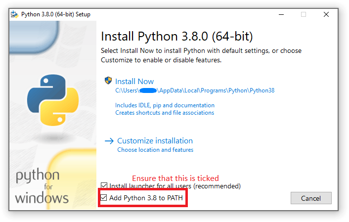
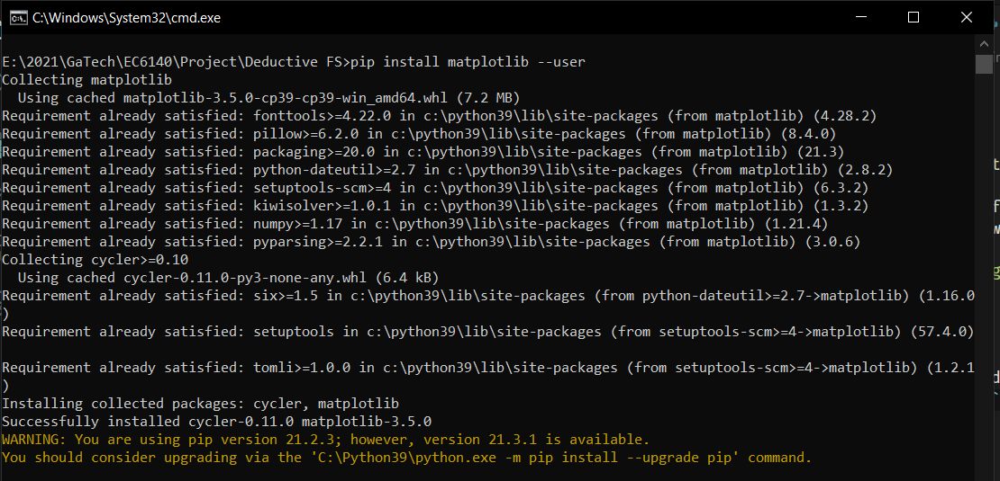
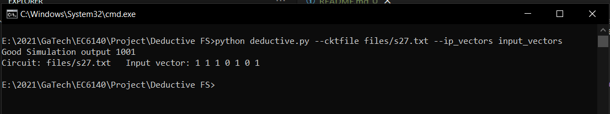
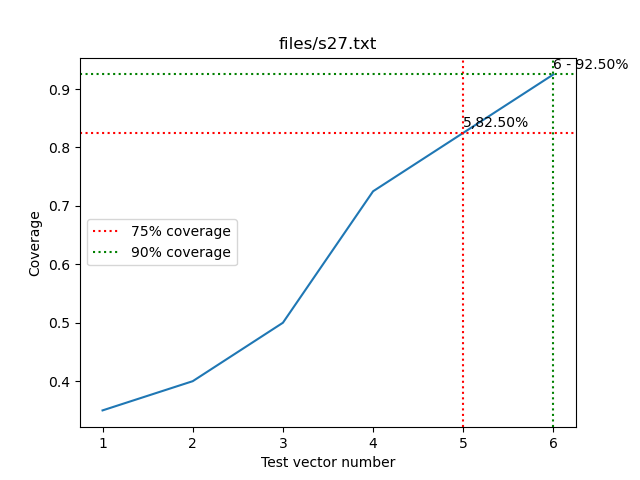

## User Manual: deductive fault simulator

### Simulation environment

This code depends on the Python 3.8+ and the MatPlotLib library to generate graphs.

Install python for your operating system from https://www.python.org/downloads/. Ensure that Python is added to path when installing on Windows as shown in the image below.

||
| :--: |
| *Check the option to Add to path* |


Then launch command prompt (Open Start and Search for Command prompt), and install matplotlib by running ``` pip install matplotlib --user```


| |
| :--: |
| *Install matplotlib* |


<!-- <div style="page-break-after: always;"></div> -->

### Running only output simulator

All commands will be ran in command prompt. 

input_vectors.txt file
```
1110101
```

To only see the outputs for a given input vector which is store in the "input_vectors" file for a circuit names s27.txt in the files folder relative to the deductive.py file, run the following

```python deductive.py --cktfile files/s27.txt --ip_vectors input_vectors```

Expected output
```
Good Simulation output 1001
Circuit: files/s27.txt   Input vector: 1 1 1 0 1 0 1
```
| |
| :--: |
| *Running only output simulator* |


### Running deductive fault simulator for a specific input vector and all faults

To check all faults that a vector can catch for a circuit s27.txt -- 

The input_vectors.txt file is as below
```
1110101
```

Run the following command

``` python deductive.py --cktfile files/s27.txt --ip_vectors input_vectors.txt --allfaults```

Expected output
```
Circuit: files/s27.txt   Input vector: 1 1 1 0 1 0 1
  1 stuck at 0
  3 stuck at 0
  5 stuck at 0
  7 stuck at 0
  9 stuck at 1
 11 stuck at 1
 12 stuck at 0
 13 stuck at 0
 ```

## Running deductive fault simulation for specific faults

Write the faults in a faultFile.txt like this

<div style="page-break-after: always;"></div>

```
1 0
2 1
3 0
4 1
7 0
```
Run

```python deductive.py --cktfile files/s27.txt --ip_vectors input_vectors --faultfile faultFile.txt```

Output
```
Good Simulation output 1001
Circuit: files/s27.txt   Input vector: 1 1 1 0 1 0 1
  1 stuck at 0
  3 stuck at 0
  7 stuck at 0
```

## Running deductive fault simulation for all faults upto coverage 0.91 and get graph

```python deductive.py --cktfile files/s349f_2.txt --randomvectors --allfaults --coverage 0.91```

Output

 

<div style="page-break-after: always;"></div>